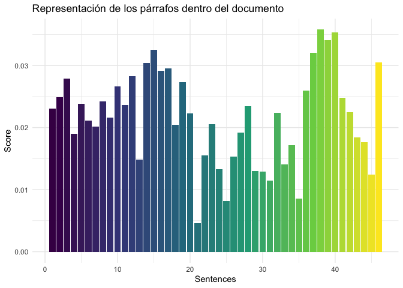
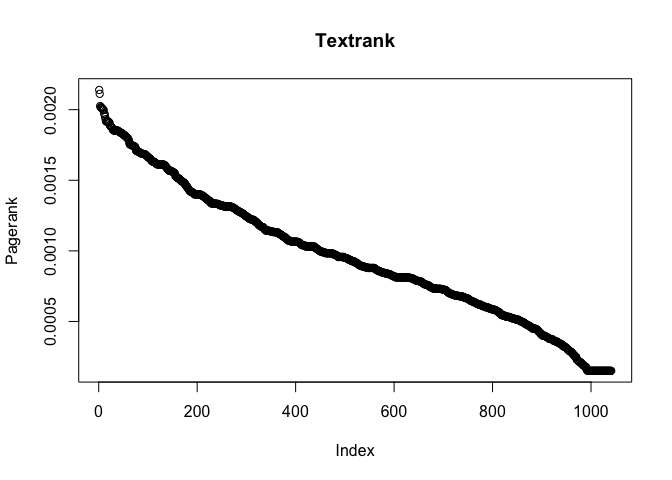

Deep Learning
================

``` r
library(tidyverse)
library(tidymodels)
library(tidytext)
library(widyr)
library(textrank)
library(stopwords)
library(scales)
library(igraph) 

theme_set(theme_classic())
```

## Bienvenida G\!\!\!

En este documento te encontraras con la primer inteligencia artificial
para este proyecto, la cual se nombra al igual que tu\!

Giulia es una AI que tiene tres funciones principales:

1.  Generar resumenes de documentos
2.  Analizar cuales son las partes importantes de los documentos
3.  Predecir que se diría en el documento si se extendiera la
    conversación

En el presente ejemplo dejo el deploy con del caso de la gaceta 0016 de
Colombia.

## Partes más importantes del texto

``` r
colombia <- read_rds('/Volumes/Daniel/BID/Bases_rds_BID/colombia.rds')
colombia%>%
  count(Comunicado, sort = TRUE)
```

    ## # A tibble: 57 x 2
    ##    Comunicado     n
    ##    <chr>      <int>
    ##  1 0010           1
    ##  2 0016           1
    ##  3 0023           1
    ##  4 09_2015        1
    ##  5 1021           1
    ##  6 114_2015       1
    ##  7 130            1
    ##  8 146            1
    ##  9 178            1
    ## 10 179            1
    ## # … with 47 more rows

``` r
comunicado_0016 <- colombia%>%
  filter(Comunicado == '0016')%>%
  pull(Texto)

article_sentences <- tibble(text = comunicado_0016) %>%
  unnest_tokens(sentence, text, token = "sentences") %>%
  mutate(sentence_id = row_number()) %>%
  select(sentence_id, sentence)

article_words <- article_sentences %>%
  unnest_tokens(word, sentence)

article_words <- article_words %>%
  filter(!word %in% bad_words)

article_summary <- textrank_sentences(data = article_sentences, 
                                      terminology = article_words)

article_summary
```

    ## Textrank on sentences, showing top 5 most important sentences found:
    ##   1. cuestionario para el señor director de la crc,  doctor carlos rebellón 1. ¿actualmente con que reglamentación se cuenta  para prevenir la concentración del mercado en el  negocio de telefonía móvil e internet móvil?
    ##   2. 3. ¿la comisión de regulación de comunicaciones ha detectado concentración de mercado en  el negocio de internet móvil?
    ##   3. 2. ¿la comisión de regulación de comunicaciones ha detectado concentración de mercado en  el negocio de telefonía móvil?
    ##   4. 2. ¿cuánto es el ancho de banda mínimo y el ancho de banda máximo en el espectro radioeléctrico  al cual puede acceder un operador para prestar el  servicio de internet móvil 4g?
    ##   5. 4. ¿cuánto es el ancho de banda mínimo y el ancho de banda máximo en el espectro radioeléctrico  al cual puede acceder un operador para prestar el  servicio de internet móvil 4g?

Las anteriores son las expresiones o párrafos que más representan al
documento, se puede decir que estas son las razones por las cuales se
desarrolla el documento.

``` r
article_summary[["sentences"]] %>%
  ggplot(aes(textrank_id, textrank, fill = textrank_id)) +
  geom_col() +
  theme_minimal() +
  scale_fill_viridis_c() +
  guides(fill = "none") +
  labs(title = 'Representación de los párrafos dentro del documento',
       y='Score',
       x='Sentences')
```

<!-- -->

## Resumen del documento

``` r
library(textmineR)
library(textreuse)
#article_sentences
```

Ejemplo con el documento

``` r
library(udpipe)
tagger <- udpipe_download_model("spanish")
article_sentences
```

    ## # A tibble: 46 x 2
    ##    textrank_id sentence                                                         
    ##          <int> <chr>                                                            
    ##  1           1 gaceta del congreso  16  miércoles, 6 de febrero de 2013 página …
    ##  2           2 2. el doctor albeiro vanegas osorio, representante a la cámara p…
    ##  3           3 22477.11 doctor hernando hernández tapasco representante a la cá…
    ##  4           4 2. proyecto de acto legislativo número 056  de 2012 cámara,  los…
    ##  5           5 3. proyecto de ley número 100 de 2011 cámara,  por la cual se vi…
    ##  6           6 5. proyecto de ley número 201 de 2012 cámara,  por el cual se cr…
    ##  7           7 secretario general, doctor jesús alfonso rodríguez camargo: prop…
    ##  8           8 secretario general, doctor jesús alfonso rodríguez camargo: han …
    ##  9           9 un intelectual de primera  categoría, tal vez no milita en ningú…
    ## 10          10 subsecretaria, doctora flor marina daza  ramírez: señor presiden…
    ## # … with 36 more rows

``` r
job_rawtxt <- paste(article_sentences$sentence, collapse = "\n")
tagger <- udpipe_download_model("spanish")
tagger <- udpipe_load_model(tagger$file_model)
joboffer <- udpipe_annotate(tagger, job_rawtxt)
joboffer <- as.data.frame(joboffer)
keyw <- textrank_keywords(joboffer$lemma,
                          relevant = joboffer$upos %in% c("NOUN", "VERB", "ADJ"))

subset(keyw$keywords, ngram > 1 & freq > 5)
```

    ##                                         keyword ngram freq
    ## 11                             señor-presidente     2  101
    ## 13                      honorable-representante     2   93
    ## 21                 carlo-andrés-amaya-rodríguez     4   78
    ## 22                       andrés-amaya-rodríguez     3   78
    ## 23                              amaya-rodríguez     2   78
    ## 26                          derecho-fundamental     2   74
    ## 33          doctor-carlo-andrés-amaya-rodríguez     5   57
    ## 39                               mesa-directivo     2   49
    ## 48                           secretario-general     2   44
    ## 57                         banco-interamericano     2   38
    ## 58                               segundo-misión     2   38
    ## 60                             acto-legislativo     2   36
    ## 69                      gracia-señor-presidente     3   31
    ## 73                               señor-ministro     2   30
    ## 74                      jesús-alfonso-rodríguez     3   29
    ## 75                            alfonso-rodríguez     2   29
    ## 92                            josé-ignacio-mesa     3   22
    ## 93                                 ignacio-mesa     2   22
    ## 95                            madre-comunitario     2   22
    ## 98                               posado-sánchez     2   21
    ## 100                           gracia-presidente     2   21
    ## 107                               partido-liber     2   20
    ## 110                          proposición-número     2   19
    ## 116                        corte-constitucional     2   19
    ## 117                                   salud-ser     2   19
    ## 120                      primero-vicepresidente     2   18
    ## 121                      segundo-vicepresidente     2   18
    ## 122                           resolución-número     2   18
    ## 125                             congreso-número     2   18
    ## 127                                   haber-ser     2   18
    ## 128                                doctor-prado     2   18
    ## 135                               excuso-válido     2   16
    ## 141                         presente-resolución     2   15
    ## 142                                pasaje-aéreo     2   15
    ## 153                              facultad-legal     2   14
    ## 154                                parte-motivo     2   14
    ## 155                    prestación-social-propio     3   14
    ## 156                               social-propio     2   14
    ## 158                      condición-congresional     2   14
    ## 159                   presente-resolución-regir     3   14
    ## 160                            resolución-regir     2   14
    ## 163                            honorable-cámara     2   14
    ## 168              doctor-jesús-alfonso-rodríguez     4   14
    ## 169                              derecho-social     2   14
    ## 173                        implicar-utilización     2   13
    ## 175                              erario-público     2   13
    ## 177 corporación-considero-importante-comisionar     4   13
    ## 178             considero-importante-comisionar     3   13
    ## 179                       importante-comisionar     2   13
    ## 181         honorable-representante-comisionado     3   13
    ## 182                   representante-comisionado     2   13
    ## 185                       constitución-política     2   13
    ## 188                                 nava-talero     2   12
    ## 192                          germán-nava-talero     3   11
    ## 193                          invitación-cursado     2   11
    ## 194                                 doctor-juar     2   11
    ## 196            doctor-flor-marina-dazar-ramírez     5   11
    ## 203                                 haber-hacer     2   11
    ## 205                            señor-secretario     2   11
    ## 206                   flor-marina-dazar-ramírez     4   11
    ## 207                        marina-dazar-ramírez     3   11
    ## 208                               dazar-ramírez     2   11
    ## 209                              internet-móvil     2   11
    ## 214                             cecilia-ramírez     2   10
    ## 215                                  ley-número     2   10
    ## 222                        publicación-ponencia     2   10
    ## 224                            comisión-séptimo     2   10
    ## 225                           señora-secretario     2   10
    ## 227                           pueblo-colombiano     2   10
    ## 231                           telésforo-pedraza     2    9
    ## 236                                  juar-carlo     2    9
    ## 239                              segundo-debate     2    9
    ## 241                         partido-conservador     2    9
    ## 249                            jaimir-buenahora     2    8
    ## 250                                 acto-número     2    8
    ## 254                             sesión-plenario     2    8
    ## 259                                 haber-tener     2    8
    ## 261                          reforma-tributario     2    8
    ## 262                           gobierno-nacional     2    8
    ## 264                            control-político     2    8
    ## 265                                 haber-decir     2    8
    ## 267                                 poder-hacer     2    8
    ## 270                               alfonso-prado     2    8
    ## 271                           doctor-salamancar     2    8
    ## 273                                  ser-humano     2    8
    ## 278                              señor-director     2    8
    ## 280                                  díaz-ortiz     2    7
    ## 281                         neber-ario-castillo     3    7
    ## 282                               ario-castillo     2    7
    ## 289                     acto-legislativo-número     3    7
    ## 290                          legislativo-número     2    7
    ## 300                                doctor-carlo     2    7
    ## 308                polo-democrático-alternativo     3    7
    ## 309                     democrático-alternativo     2    7
    ## 313                            comisión-primero     2    7
    ## 315                             ley-estatutario     2    7
    ## 324                                  hugo-orlar     2    6
    ## 327                            gómez-villamizar     2    6
    ## 330                                germán-varón     2    6
    ## 335                        efraín-antonio-torre     3    6
    ## 336                               antonio-torre     2    6
    ## 337                           iv-darío-sandoval     3    6
    ## 338                              darío-sandoval     2    6
    ## 342                       compensación-familiar     2    6
    ## 348                             partido-liberal     2    6
    ## 353                              quedar-cerrado     2    6
    ## 355                        doctor-alfonso-prado     3    6
    ## 358                     espectro-radioeléctrico     2    6
    ## 360                         congreso-colombiano     2    6
    ## 361                             comisión-quinto     2    6
    ## 365                               doctor-martha     2    6
    ## 366                              tema-pensional     2    6

``` r
joboffer$textrank_id <- unique_identifier(joboffer, c("doc_id", "paragraph_id", "sentence_id"))
sentences <- unique(joboffer[, c("textrank_id", "sentence")])
terminology <- subset(joboffer, upos %in% c("NOUN", "ADJ"))
terminology <- terminology[, c("textrank_id", "lemma")]
tr <- textrank_sentences(data = sentences, terminology = terminology)
plot(sort(tr$pagerank$vector, decreasing = TRUE), 
     type = "b", ylab = "Pagerank", main = "Textrank")
```

<!-- -->

``` r
s <- summary(tr, n = 200)
s <- summary(tr, n = 200, keep.sentence.order = TRUE)
cat(s, sep = "\n")
```

    ## ................................. 17 intervención del honorable representante obed de jesús zuluaga henao.
    ## ...................................... 18 intervención del honorable representante obed de jesús zuluaga henao.
    ## .................................. 18 intervención del honorable representante carlos germán navas talero.
    ## ......................... 20 intervención del honorable representante carlos eduardo león celis.
    ## intervención del honorable representante juan carlos salazar uribe.
    ## ................. 29 intervención del honorable representante oscar de jesús marín marín.
    ## .................................. 30 intervención del honorable representante jimmy javier sierra león.
    ## presidencia de los honorables representantes, augusto posada sánchez, josé ignacio mesa betancur, carlos andrés amaya rodríguez.
    ## en la sesión plenaria de la fecha, hay 164 representantes a la cámara, teniendo en cuenta que el doctor carlos alberto escobar córdoba, representante a la cámara por el departamento del chocó, fue suspendido mediante proposición número 030 de agosto 21 de 2012.
    ## 2. el doctor albeiro vanegas osorio, representante a la cámara por el departamento de arauca, tiene resolución número 2349 de 2012 “por la cual representante a la cámara”, pero se registró electrónicamente.
    ## excusas de los representantes * * * resolución número md2419 de 2012 (septiembre 28) honorable representante a la cámara.
    ## la mesa directiva de la cámara de representantes, en uso de sus facultades legales y en especial las considerando: que el numeral 8 del artículo 41 de la ley 5ª de 1992, faculta a la mesa directiva de la cámara de les de congresistas fuera de la sede del congreso siempre que no impliquen utilización de dineros del erario público.
    ## que el representante a la cámara, doctor bayardo septiembre 28 de 2012, informa ante el secretario general de la corporación, que se ausentará del país con el propósito de atender la invitación cursada por el banco interamericano de desarrollo a participar en la segunda misión de miembros del congreso de la república de colombia a la ciudad de washington d. c., del 1° al 3 de octubre de 2012.
    ## que la mesa directiva de la corporación considera importante comisionar al honorable representante a la cámara, doctor bayardo gilberto betancourt pérez, para que atienda la invitación del banco interamericano de desarrollo y participe en la segunda misión de miembros del congreso de la república de colombia a la ciudad de washington d. c., del 1° al 3 de octubre de 2012.
    ## que en mérito de lo expuesto, resuelve: rable representante a la cámara, doctor bayardo gilberto betancourt pérez, para que atienda la invitación del banco interamericano de desarrollo y participe en la segunda misión de miembros del congreso de la república de colombia a la ciudad de washington d. c., del 1° al 3 de octubre de 2012, de conformidad con lo expuesto en la parte motiva de la presente resolución.
    ## * * * resolución número md-2373 de 2012 (septiembre 26) honorable representante a la cámara.
    ## la mesa directiva de la cámara de representantes, en uso de sus facultades legales y en especial las gaceta del congreso 16 miércoles, 6 de febrero de 2013 página 5 considerando: que el numeral 8 del artículo 41 de la ley 5ª de 1992, faculta a la mesa directiva de la cámara de congresistas fuera de la sede del congreso siempre que no impliquen utilización e dineros del erario público.
    ## que el representante a la cámara, doctor eduarseptiembre 25 de 2012, solicita ante el presidente de el propósito de atender la invitación cursada por el banco interamericano de desarrollo a participar en la segunda misión de miembros del congreso de la república de colombia a la ciudad de washington d. c., del 1° al 3 de octubre de 2012.
    ## que la mesa directiva de la corporación considera importante comisionar al honorable representante a la cámara, doctor eduardo josé castañeda murillo, para que atienda la invitación del banco interamericano de desarrollo y participe en la segunda misión de miembros del congreso de la república de colombia a la ciudad de washington d. c., del 1° al 3 de octubre de 2012.
    ## que en mérito de lo expuesto, resuelve: representante a la cámara, doctor eduardo josé castañeda murillo, para que atienda la invitación del banco interamericano de desarrollo y participe en la segunda misión de miembros del congreso de la república de colombia a la ciudad de washington d. c., del 1° al 3 de octubre de 2012, de conformidad con lo expuesto en la parte motiva de la presente resolución.
    ## * * * resolución número md-2348 de 2012 (septiembre 25) a un honorable representante a la cámara.
    ## la mesa directiva de la cámara de representantes, en uso de sus facultades legales y en especial considerando: que el numeral 8 del artículo 41 de la ley 5ª de 1992, faculta a la mesa directiva de la cámara de les de congresistas fuera de la sede del congreso siempre que no impliquen utilización de dineros del erario público.
    ## que el representante a la cámara, doctor alfredo rafael deluque zuleta mediante oficio de fecha septiembre 18 de 2012, solicita ante el secretario general de la corporación, se le confiera comisión oficial con el propósito de atender la invitación cursada por el banco interamericano de desarrollo a participar en la segunda misión de miembros del congreso de la república de colombia a la ciudad de washington d. c., del 1° al 3 de octubre de 2012.
    ## que la mesa directiva de la corporación considera importante comisionar al honorable representante a la cámara, doctor alfredo rafael deluque zuleta, para que atienda la invitación del banco interamericano de desarrollo y participe en la segunda misión de miembros del congreso de la república de colombia a la ciudad de washington d. c., del 1º al 4 de octubre de 2012.
    ## que en mérito de lo expuesto, resuelve: primero (1°) y el cuatro (4) de octubre de 2012, al honorable representante a la cámara, doctor alfredo rafael deluque zuleta, para que atienda la invitación del bando interamericano de desarrollo y participe en la segunda misión de miembros del congreso de la república de colombia a la ciudad de washington d. c., de conformidad con lo expuesto en la parte motiva de la presente resolución.
    ## en ejercicio de funciones presidenciales (artículo 45 ley 5ª de 1992) copias: comisión de acreditación documental subsecretaría general hermes tafur vásquez secretario general * * * resolución número md-2416 de 2012 (septiembre 28) honorable representante a la cámara.
    ## la mesa directiva de la cámara de representantes, en uso de sus facultades legales y en especial las considerando: que el numeral 8 del artículo 41 de la ley 5ª de 1992, faculta a la mesa directiva de la cámara de les de congresistas fuera de la sede del congreso siempre que no impliquen utilización de dineros del erario público.
    ## que el representante a la cámara, doctor juan septiembre 27 de 2012, solicita ante el presidente de la corporación, permiso por los días 1°, 2 y 3 de octubre del año en curso, con el propósito de atender la invitación cursada por el banco interamericano de desarrollo a participar en la segunda misión de miembros del congreso de la república de colombia a la ciudad de washington d. c. que la mesa directiva de la corporación considera importante comisionar al honorable representante a la cámara, doctor juan carlos martínez gutiérrez, para que atienda la invitación del banco interamericano de desarrollo y participe en la segunda misión de miembros del congreso de la república de colombia a la ciudad de washington d. c., del 1° al 3 de octubre de 2012.
    ## que en mérito de lo expuesto, resuelve: rable representante a la cámara, doctor juan carlos martínez gutiérrez, para que atienda la invitación del banco interamericano de desarrollo y participe en la segunda misión de miembros del congreso de la república de colombia a la ciudad de washington d. c., del 1° al 3 de octubre de 2012, de conformidad con lo expuesto en la parte motiva de la presente resolución.
    ## * * * resolución número md-2351 de 2012 (septiembre 25) a un honorable representante a la cámara.
    ## la mesa directiva de la cámara de representantes, en uso de sus facultades legales y en especial las considerando: que el numeral 8 del artículo 41 de la ley 5ª de 1992, faculta a la mesa directiva de la cámara de les de congresistas fuera de la sede del congreso siempre que no impliquen utilización de dineros del erario público.
    ## que la mesa directiva de la corporación considera importante comisionar al honorable representante a la cámara, doctor josé ignacio mesa betancur, para que atienda la invitación del banco interamericano de desarrollo y participe en la segunda misión de miembros del congreso de la república de colombia a la ciudad de washington d. c., del 1° al 4 de octubre de 2012.
    ## que en mérito de lo expuesto, resuelve: primero (1°) y el cuatro (4) de octubre de 2012, al honorable representante a la cámara, doctor josé ignacio mesa betancur, para que atienda la invitación del banco interamericano de desarrollo y participe en la segunda misión de miembros del congreso de la república de colombia a la ciudad de washington d. c., de conformidad con lo expuesto en la parte motiva de la presente resolución.
    ## * * * bogotá d. c., octubre 2 de 2012 docto jesús alfonso rodríguez secretario general cámara de representante doctor rodríguez: como es sabido por la opinión pública el día 5 de septiembre fue detenido preventivamente el representante jorge hernán mesa botero, y siguiendo instrucciones del doctor jorge hernán mesa muy respetuosamente presento ante su despacho excusas por la no asistencia del representante mesa, a las secciones de plenaria los días martes 2 y miércoles 3 de octubre del 2012.
    ## * * * resolución número md-2363 de 2012 (septiembre 26) a un honorable representante a la cámara.
    ## la mesa directiva de la cámara de representantes, en uso de sus facultades legales y en especial las considerando: que el numeral 8 del artículo 41 de la ley 5ª de 1992, faculta a la mesa directiva de la cámara de les de congresistas fuera de la sede del congreso siempre que no impliquen utilización de dineros del erario público.
    ## que el representante a la cámara, doctor alfredo 2012, solicita ante el presidente de la corporación, autorizar su participación en el congreso internacional sobre la valorización energética de residuos recuwatt 2ª edición, a realizarse en barcelona, españa del 1° al 3 de octubre de 2012.
    ## * * * bogotá, d. c., octubre del 2012 doctor jesús alfonso rodríguez secretario general cámara de representantes ciudad asunto: excusa por no asistir por instrucciones del honorable representante hernán penagos giraldo comedidamente me permito impetrarle se sirva excusarlo por no concurrir a las sesiones de las plenarias programadas para los días 2, 3 y 4 de octubre del año en curso, en consideración a que el representante se encontraba fuera del país en a cabo en la ciudad de washington, d. c., desde el día 1° al 3 de octubre del año que avanza.
    ## * * * resolución número md-2418 de 2012 (septiembre 28) a un honorable representante a la cámara.
    ## la mesa directiva de la cámara de representantes, en uso de sus facultades legales y en especial las considerando: que el numeral 8 del artículo 41 de la ley 5ª de 1992, faculta a la mesa directiva de la cámara de congresistas fuera de la sede del congreso siempre que no impliquen utilización de dineros del erario público.
    ## que el representante a la cámara, doctor hernán 26 de 2012, solicita ante el presidente de la corporación, autorización con el propósito de atender la invitación cursada por el banco interamericano de desarrollo a participar en la segunda misión de miembros del congreso de la república de colombia a la ciudad de washington d. c., del 1º al 3 de octubre de 2012.
    ## que la mesa directiva de la corporación considera importante comisionar al honorable representante a la cámara, doctor hernán penagos giraldo, para que atienda la invitación del banco interamericano de desarrollo y participe en la segunda misión de miembros del congreso de la república de colombia a la ciudad de washington d. c., del 1° al 3 de octubre de 2012.
    ## que en mérito de lo expuesto, resuelve: tante a la cámara, doctor hernán penagos giraldo, para que atienda la invitación del banco interamericano de desarrollo y participe en la segunda misión de miembros del congreso de la república de colombia a la ciudad de washington d. c., del 1° al 3 de octubre de 2012, de conformidad con lo expuesto en la parte motiva de la presente resolución.
    ## * * * bogotá d. c., 28 de septiembre de 2012 doctor augusto posada presidente cámara de representantes ciudad respetado señor presidente: con base en la resolución número 2366 del 26 de septiembre de 2012, me permito presentar excusa gaceta del congreso 16 miércoles, 6 de febrero de 2013 página 9 para la sesión de los días martes 2 y miércoles 3 de octubre de 2012.
    ## * * * resolución número md-2366 de 2012 (septiembre 26) honorable representante a la cámara.
    ## la mesa directiva de la cámara de representantes, en uso de sus facultades legales y en especial las considerando: que el numeral 8 del artículo 41 de la ley 5ª de 1992, faculta a la mesa directiva de la cámara de les de congresistas fuera de la sede del congreso siempre que no impliquen utilización de dineros del erario público.
    ## que el representante a la cámara, doctor pedro tiembre 25 de 2012, solicita ante el presidente de el propósito de atender la invitación cursada por el banco interamericano de desarrollo a participar en la segunda misión de miembros del congreso de la república de colombia a la ciudad de washington d. c., del 1° al 3 de octubre de 2012.
    ## que la mesa directiva de la corporación considera importante comisionar al honorable representante a la cámara, doctor pedro pablo pérez puerta, para que atienda la invitación del banco interamericano de desarrollo y participe en la segunda misión de miembros del congreso de la república de colombia a la ciudad de washington d. c., del 1° al 3 de octubre de 2012.
    ## que en mérito de lo expuesto, resuelve: norable representante a la cámara, doctor pedro pablo pérez puerta, para que atienda la invitación del banco interamericano de desarrollo y participe en la segunda misión de miembros del congreso de la república de colombia a la ciudad de washington d. c., del 1° al 3 de octubre de 2012, de conformidad con lo expuesto en la parte motiva de la presente resolución.
    ## * * * resolución número md-2350 de 2012 (septiembre 25) honorable representante a la cámara.
    ## que la mesa directiva de la corporación considera importante comisionar al honorable representante a la cámara, doctor augusto posada sánchez, para que atienda la invitación del banco interamericano de desarrollo y participe en la segunda misión de miembros del congreso de la república de colombia a la ciudad de washington d. c., del 1° al 4 de octubre de 2012.
    ## que en mérito de lo expuesto, resuelve: primero (1°) y el cuatro (4) de octubre de 2012, al honorable representante a la cámara, doctor augusto posada sánchez, para que atienda la invitación del banco interamericano de desarrollo y participe en la segunda misión de miembros del congreso de la república de colombia a la ciudad de washington d. c., de conformidad con lo expuesto en la parte motiva de la presente resolución.
    ## * * * bogotá d. c., octubre 2 de 2012 doctor jesús alfonso rodríguez secretario general honorable cámara de representantes respetado doctor: por instrucciones del honorable representante gustavo hernán puentes díaz, me permito anexar resolución donde consta, que los días 1º, 2 y 3 de cursada por el banco interamericano de desarrollo a participar en la segunda misión de miembros del congreso de la república de colombia a la ciudad de washington d. c. motivo por la cual solicito sea excusado en las sesiones de la corporación que se llegaren a convocar.
    ## * * * resolución número md-2365 de 2012 (septiembre 26) a un honorable representante a la cámara.
    ## que el representante a la cámara, doctor gusseptiembre 25 de 2012, solicita ante el presidente de el propósito de atender la invitación cursada por el banco interamericano de desarrollo a participar en la segunda misión de miembros del congreso de la república de colombia a la ciudad de washington d. c., del 1° al 3 de octubre de 2012.
    ## que la mesa directiva de la corporación considera importante comisionar al honorable representante a la cámara, doctor gustavo hernán puentes díaz, para que atienda la invitación del banco interamericano de desarrollo y participe en la segunda misión de miembros del congreso de la república de colombia a la ciudad de washington d. c., del 1° al 3 de octubre de 2012.
    ## que en mérito de lo expuesto, resuelve: conferir comisión oficial al honorable representante a la cámara, doctor gustavo hernán puentes díaz, para que atienda la invitación del banco interamericano de desarrollo y participe en la segunda misión de miembros del congreso de la república de colombia a la ciudad de washington d. c., del 1° al 3 de octubre de 2012, de conformidad con lo expuesto en la parte motiva de la presente resolución.
    ## * * * bogotá, d. c., 1° de octubre de 2012 doctor augusto posada sánchez presidente cámara de representantes respetado doctor: me permito presentar excusa formal por mi inasistencia a la sesión plenaria los días 2 y 3 de octubre, en razón a que me encuentro en la ciudad de washington d. c., en la discusión de la agenda de implementación de los tlc entre colombia y corea y la unión europea, conforme a la invitación que gaceta del congreso 16 miércoles, 6 de febrero de 2013 página 11 se me hiciera por parte del ministerio de comercio documento adjunto en dos folios.
    ## * * * resolución número md-2367 de 2012 (septiembre 26) honorable representante a la cámara.
    ## que el representante a la cámara, doctor iván tiembre 26 de 2012, solicita ante el secretario general el propósito de atender la invitación cursada por el banco interamericano de desarrollo a participar en la segunda misión de miembros del congreso de la república de colombia a la ciudad de washington d. c., del 1° al 3 de octubre de 2012.
    ## que la mesa directiva de la corporación considera importante comisionar al honorable representante a la cámara, doctor iván darío sandoval perilla, para que atienda la invitación del banco interamericano de desarrollo y participe en la segunda misión de miembros del congreso de la república de colombia a la ciudad de washington d. c., del 1° al 3 de octubre de 2012.
    ## que en mérito de lo expuesto, resuelve: rable representante a la cámara, doctor iván darío sandoval perilla, para que atienda la invitación del banco interamericano de desarrollo y participe en la segunda misión de miembros del congreso de la república de colombia a la ciudad de washington d. c., del 1° al 3 de octubre de 2012, de conformidad con lo expuesto en la parte motiva de la presente resolución.
    ## página 12 miércoles, 6 de febrero de 2013 gaceta del congreso 16 bogotá, 2 de octubre de 2012 doctora flor marina daza ramírez subsecretaria general honorable cámara de representantes ciudad respetada doctora: me permito presentar excusas por la inasistencia del honorable representante a la cámara efraín torres monsalvo a la sesión plenaria programada para el día de hoy 2 de octubre del año en curso a las 3:00 p. m., ya que mediante resolución número 2361 del 26 de septiembre del presente, se le concedió permiso para ausentarse del país.
    ## anexo: fotocopia resolución número 2361 * * * resolución número md-2361 de 2012 ( septiembre 26) por la cual se concede un permiso a un honorable representante a la cámara.
    ## que el artículo 123 de la constitución política, establece que los honorables representantes a la cámara son servidores públicos.
    ## conceder permiso remunerado al honorable representante a la cámara, doctor efraín antonio torres monsalvo para que se ausente de sus funciones congresuales por los días veintisiete (27) de septiembre, dos (2) y tres (3) de octubre de 2012, de conformidad con lo expuesto en la parte motiva de la presente resolución.
    ## * * * bogotá, d. c., 1° de octubre de 2012 doctor jesús alfonso rodríguez secretario general cámara de representantes bogotá, d. c.
    ## respetado doctor: por instrucciones del representante a la cámara, doctor carlos alberto zuluaga díaz, cordialmente me permito remitir copia de la resolución número 2364 del 26 de septiembre del presente año, expedida por la mesa directiva de esta corporación, en gaceta del congreso 16 miércoles, 6 de febrero de 2013 página 13 la cual se le autoriza para ausentarse con excusa válida de las sesiones de comisión y de plenaria, convocadas para los días 2 y 3 de octubre del año en curso.
    ## resolución n° md2364 de 2012 (septiembre 26) a un honorable representante a la cámara.
    ## que el representante a la cámara, doctor carlos tiembre 25 de 2012, solicita ante el secretario general el propósito de atender la invitación cursada por el banco interamericano de desarrollo a participar en la segunda misión de miembros del congreso de la república de colombia a la ciudad de washington d. c. del 1° al 3 de octubre de 2012.
    ## que la mesa directiva de la corporación considera importante comisionar al honorable representante a la cámara, doctor carlos alberto zuluaga díaz, para que atienda la invitación de;
    ## banco interamericano de desarrollo y participe en la segunda misión de miembros del congreso de la república de colombia a l ciudad de washington d. c., del 1° al 3 de octubre de 2012, que en mérito de lo expuesto resuelve: norable representante a la cámara, doctor carlos alberto zuluaga díaz, para que atienda la invitación del banco interamericano de desarrollo y participe en la segunda misión de miembros del congreso de la república de colombia a la ciudad de washington d. c., del 1° al 3 de octubre de 2012, de conformidad con lo expuesto en la parte motiva de la presente resolución.
    ## * * * resolución n° md2349 de 2012 (septiembre 25) a un honorable representante a la cámara.
    ## que el representante a la cámara, doctor albeiro 19 de 2012, solicita ante el secretario general de el propósito de atender la invitación cursada por el banco interamericano de desarrollo a participar en la segunda misión de miembros del congreso de la república de colombia a la ciudad de washington d. c., del 1° al 3 de octubre de 2012.
    ## que la mesa directiva de la corporación considera importante comisionar al honorable representante a la cámara, doctor albeiro vanegas osorio, para que atienda la invitación del banco interamericano de desarrollo y participe en la segunda misión de miembros del congreso de la república de colombia a la ciudad de washington d. c., del 1° al 3 de octubre de 2012.
    ## que en mérito de lo expuesto, resuelve: representante a la cámara, doctor albeiro vanegas osorio, para que atienda la invitación del banco interamericano de desarrollo y participe en la segunda misión de miembros del congreso de la república de colombia a la ciudad de washington d. c., del 1° al 3 de octubre de 2012, de conformidad con lo expuesto en la parte motiva de la presente resolución.
    ## iii negocios sustanciados por la presidencia iv lo que propongan los honorables representantes el presidente, augusto posada sánchez el primer vicepresidente, josé ignacio mesa betancur el segundo vicepresidente, carlos andrés amaya rodríguez el secretario general, jesús alfonso rodriguez camargo la subsecretaria general, flor marina daza ramírez.
    ## era para exaltar el día de los boyacenses señor presidente y en especial que haya un boyacense presidiendo la cámara de representantes.
    ## dirección de la presidencia, doctor carlos andrés amaya rodríguez: doctor dídier tavera mil gracias por sus palabras, me enorgullece escucharlas y gracias sobre todo por su amistad.
    ## intervención del honorable representante telésforo pedraza ortega: muchas gracias señor presidente, creo que no hay uno solo de mis colegas que no haya tenido la oportunidad de haber escuchado en la noche de ayer la intervención del señor presidente de la república el doctor juan manuel santos.
    ## dirección de la presidencia, doctor carlos andrés amaya rodríguez: a usted doctor telésforo por su solicitud, entonces le solicitamos a la secretaría de la cámara de representantes que redacte una nota y la podamos enviar a la casa de nariño al presidente de la república, deseándole pronta recuperación y éxitos en su intervención, con gusto doctor telésforo pedraza.
    ## dirección de la presidencia, doctor carlos andrés amaya rodríguez: gracias doctor rafael piñeros por su intervención.
    ## intervención del honorable representante heriberto escobar gonzález: gracias señor presidente, de igual manera como lo hacia el doctor telésforo pedraza, en nombre del partido de integración y como vocero del pin, nos solidarizamos con la salud del señor presidente doctor juan manuel santos, vamos a hacer una oración en el partido para que el presiente tenga una pronta recuperación, lo necesitamos vital, vigoroso y en buen estado con este nuevo proceso de paz que le ha costado al gobierno nacional.
    ## gracias señor presidente.
    ## gaceta del congreso 16 miércoles, 6 de febrero de 2013 página 17 dirección de la presidencia, doctor carlos andrés amaya rodríguez: muchas gracias por sus generosas palabras doctor heriberto escobar.
    ## intervención del honorable representante laureano augusto acuña díaz: gracias señor presidente, señor presidente para también solidarizarme con la salud del señor presidente, pero a la vez para manifestarle que en el departamento del atlántico en el mes de noviembre, se van a cumplir dos años del desastre que fue productor el fenómeno de la niña, mientras que el doctor dídier tiene alegría por las festividades del departamento de boyacá.
    ## dirección de la presidencia, doctor carlos andrés amaya rodríguez: gracias a usted doctor laureano acuña.
    ## dirección de la presidencia, doctor carlos andrés amaya rodríguez: departamento de antioquia, partido conservador.
    ## intervención del honorable representante obed de jesús zuluaga henao: presidente no, simplemente para solicitarle que se lea el orden del día y más adelantico me dé la palabra.
    ## dirección de la presidencia, doctor carlos andrés amaya rodríguez: señora secretaria sírvase por favor leer el orden del día, señor secretario perdón.
    ## secretario general, doctor jesús alfonso rodríguez camargo: sí señor presidente con el mayor gusto, señora subsecretaria proceda a cumplir la orden del señor presidente.
    ## dirección de la presidencia, doctor carlos andrés amaya rodríguez: gracias señora secretaria.
    ## dirección de la presidencia, doctor carlos andrés amaya rodríguez: gracias doctor buenahora.
    ## gracias señor presidente.
    ## dirección de la presidencia, doctor carlos andrés amaya rodríguez: gracias doctora gloria stella díaz.
    ## intervención del honorable representante obed de jesús zuluaga henao: señor presidente, yo iba hacer otro tipo de intervención, pero veo aquí al señor ministro de salud doctor alejandro gaviria.
    ## dirección de la presidencia, doctor carlos andrés amaya rodríguez: gracias a usted doctor zuluaga.
    ## intervención del honorable representante wilson neber arias castillo: gracias presidente, yo creo que todo mundo hoy va querer hablarle al ministro y a los ministro en general.
    ## dirección de la presidencia, doctor carlos andrés amaya rodríguez: gracias a usted doctor wilson arias.
    ## intervención del honorable representante carlos germán navas talero: gracias señor presidente, me place ver a la juventud en el poder, ya era hora y me gusta su independencia, cuando vota no consulta los directorios, sino consulta su conciencia, eso le aplaudo a usted.
    ## dirección de la presidencia, doctor carlos andrés amaya rodríguez: gracias maestro germán navas talero.
    ## página 20 miércoles, 6 de febrero de 2013 gaceta del congreso 16 intervención del honorable representante jaime buenahora febres-cordero: muchas gracias doctor amaya, ayer cuando oíamos al señor presidente de la república doctor juan manuel santos, comunicarle al país su enfermedad, sentimos inmensa tristeza, pero a medida que evolucionaban sus frases, despertamos en esperanza y sobre todo en solidaridad.
    ## dirección de la presidencia, doctor carlos andrés amaya rodríguez: para poner en consideración el orden del día y votarlo, antes la intervención del doctor carlos león celis departamento de norte de santander, partido conservador, bien pueda doctor carlos león.
    ## intervención del honorable representante carlos eduardo león celis: gracias señor presidente, en el mismo sentido para solidarizarme con el señor presidente de la república y su familia, yo creo que es un momento difícil, pero un momento de mucha fe y de igual manera es un tema que genera un gran debate en el tema de la salud y no solamente la salud del presidente, sino la salud de los colombianos.
    ## yo sé que el señor presidente está muy comprometido con el tema de la salud, sé que el ministro también y espero que se recupere pronto y que reitero, ojalá este congreso siga trabajando para que el tema de la salud en el país mejore sustancialmente.
    ## dirección de la presidencia, doctor carlos andrés amaya rodríguez: gracias a usted doctor carlos león celis.
    ## secretario general, doctor jesús alfonso rodríguez camargo: es una sesión de carácter protocolario, es decir, es un acto al que los representantes que consideren importante asistir pueden hacerlo y está pues este apoyo logístico de parte de la cámara y el evento ha sido organizado principalmente por el presidente del senado de la república y pues la secretaría también dispondrá de los medios logísticos con la presencia de dos hijos directos de boyacá que estaremos delegando, para que hagan presencia allá de parte de la secretaría general, entonces es un acto protocolario honorables representantes.
    ## dirección de la presidencia, doctor carlos andrés amaya rodríguez: entonces, con la aclaración del señor secretario, es un acto protocolario pero la mesa directiva de manera especial quiere hacerles una invitación a los representantes a la cámara, para que puedan participar de la celebración, repito, de los 200 años gaceta del congreso 16 miércoles, 6 de febrero de 2013 página 21 de la instalación del primer congreso de los estados unidos de la nueva granada.
    ## se pone en consideración el orden del día, señora secretaria por favor leer la proposición radicada de secretario general, doctor jesús alfonso rodríguez camargo: señor presidente, hay una propuesta suscrita por el senador plinio olano en su calidad de director del partido de la u, en el cual solicita que se aplace la discusión del proyecto de acto legislativo.
    ## dirección de la presidencia, doctor carlos andrés amaya rodríguez: se pone en consideración el orden del día con la proposición leída, se abre la discusión, anuncio que se va a cerrar, queda cerrada, ¿aprueba la cámara de representantes?
    ## secretario general, doctor jesús alfonso rodríguez camargo: propuesta por el director del partido de la u y anticipándole señor presidente que existe quorum ca la secretaría de acuerdo al registro de asistencia electrónico a la vista.
    ## dirección de la presidencia, doctor carlos andrés amaya rodríguez: gracias señor secretario, les pedimos el favor a los partidos que discutan en bancada el proyecto de ley que ha sido aplazado, con el objeto que en la abordada esa discusión en cada una de las bancadas.
    ## secretario general, doctor jesús alfonso rodríguez camargo: han sido leídas las actas señor presidente, puede usted someterlas a discusión y aprobación de la plenaria.
    ## dirección de la presidencia, doctor carlos andrés amaya rodríguez: gracias señor secretario y se ponen en discusión las actas leídas, se abre la discusión, anuncio que se va a cerrar, queda cerrada, ¿aprueba la cámara de representantes?
    ## dirección de la presidencia, doctor carlos andrés amaya rodríguez: siguiente punto en el orden del día señor secretario.
    ## secretario general, doctor jesús alfonso rodríguez camargo: el siguiente punto en el orden del día es el proyecto de acto legislativo 040 de 2012, por la cual se adicionan dos incisos al artículo 11 de la constitución política, que eleva a derecho fundamental la salud de todos los colombianos en primera vuelta.
    ## dirección de la presidencia, doctor carlos andrés amaya rodríguez: se va a poner en consideración la ponencia negatique pueda acercarse para sustentarla, pero antes está aquí presente el ministro de salud que quería hacer una intervención frente al proyecto de ley ¿el señor ministro de salud todavía se encuentra presente?, se retiró, bueno, el señor ministro de salud se hizo del gobierno, pero tuvo que retirarse, le voy a dar la palabra a la doctora alba luz pinilla del polo democrático alternativo bogotá.
    ## intervención de la honorable representante alba luz pinilla pedraza: gracias presidente, creo que me leyó la mente usted y efectivamente quiero que un compañero de nos explique por qué nos lo están proponiendo para saber efectivamente cómo la votamos.
    ## gracias señor presidente.
    ## página 22 miércoles, 6 de febrero de 2013 gaceta del congreso 16 dirección de la presidencia, doctor carlos andrés amaya rodríguez: gracias a usted doctora alba luz.
    ## dirección de la presidencia, doctor carlos andrés amaya rodríguez: no hay ningún representante presente en este secretario general, doctor jesús alfonso rodríguez camargo: no señor presidente, parece que se retiraron del recinto, pero señor presidente, usted puede solicitar la nencia en relación, que opinan de esta, darle el trámite y después, si llegare a ser negada esta proposición de archivo, se pasaría a votar la ponencia que el doctor pablo salamanca suscribió.
    ## se ha hecho presente el doctor carlos augusto rojas, doctor carlos augusto rojas, el señor presidente quiere conocer su opinión sobre la ponencia de archivo al proyecto de acto legislativo que está en el orden del día.
    ## dirección de la presidencia, doctor carlos andrés amaya rodríguez: doctor alfonso prada vocero del partido verlegislativo, por lo cual le solicito en nombre de la plenaria, permita ilustrarnos sobre el sustento de la proposición de archivo.
    ## intervención del honorable representante hernando alfonso prada gil: gracias presidente, voy a intentar entonces en este breve tiempo explicar esta ponencia negativa a este proyecto de reforma constitucional de autoría del doctor salamanca y otro grupo de ilustres colegas en la cámara y en el senado.
    ## dirección de la presidencia, doctor carlos andrés amaya rodríguez: gracias doctor prada por su importante intervención y argumentación.
    ## intervención del honorable representante wilson neber arias castillo: gracias presidente, realmente sí puede ser bastante corto, solamente para señalar, el doctor prada hace un altísimo reconocimiento al doctor salamanca y a sus preocupaciones pero presenta ponencia negando la que considero yo, es una de las más importantes, francamente pues para anunciar el voto de acompañamiento doctor salamanca.
    ## dirección de la presidencia, doctor carlos andrés amaya rodríguez: gracias a usted doctor wilson arias.
    ## página 24 miércoles, 6 de febrero de 2013 gaceta del congreso 16 intervención de la honorable representante martha cecilia ramírez orrego: muchas gracias señor presidente, me uno al mensaje de felicitación en el día de los boyacenses y muy importante que usted esté en esa dignidad, el representante más joven de esta cámara.
    ## muchas gracias señor presidente.
    ## dirección de la presidencia, doctor carlos andrés amaya rodríguez: a usted doctora martha ramírez.
    ## intervención del honorable representante obed de jesús zuluaga henao: presidente, se plantea por estos días una ley estatutaria en salud, que tengo entendido va a ser consensuada entre el gobierno y los diferentes actores, propuestas que hay de las diferentes bancadas del congreso y concretamente en la cámara.
    ## dirección de la presidencia, doctor carlos andrés amaya rodríguez: por el polo democrático alternativo, bancada de bogotá.
    ## intervención del honorable representante carlos germán navas talero: gracias, lamento apartarme de lo que ha dicho el doctor obed, casi siempre estamos de acuerdo, pero partimos de una cosa donde nos diferencia.
    ## dirección de la presidencia, doctor carlos andrés amaya rodríguez: gracias doctor germán navas talero.
    ## intervención del honorable representante miguel gómez martínez: gracias presidente, creo que en este debate de mucha importancia estamos confundiendo dos temas.
    ## gracias señor presidente.
    ## dirección de la presidencia, doctor carlos andrés amaya rodríguez: gracias a usted doctor miguel gómez.
    ## intervención de la honorable representante alba luz pinilla pedraza: gracias señor presidente, mire, yo he venido sidente que hagamos un repaso de dónde nacen los derechos fundamentales, desde la época de francia, un derecho fundamental es un derecho inherente al hombre, que le corresponde al hombre en su esencia, no estamos hablando, doctor gómez ni doctor prada, de los que se considera aquí la salud.
    ## gracias señor presidente.
    ## dirección de la presidencia, doctor carlos andrés amaya rodríguez: departamento del meta, partido liberal, doctor hugo velásquez.
    ## intervención del honorable representante hugo orlando velásquez jaramillo: gracias presidente, que curioso, pero el doctor alfonso prada a mí sí me persuadió con sus argumentos doctor obed zuluaga, es que cuando el doctor prada nos recuerda la corte constitucional, ahí está la razón por la cual nosotros debemos apoyar este proyecto de acto legislativo es que la corte constitucional en más de una ocasión, le ha trazado directrices al congreso de la república, muchas de las decisiones incluso de rango constitucional son el camino que ha señalado la corte constitucional en más de una sentencia de tutela y si hablamos del derecho a la salud como lo dice el doctor prada, reconocido reiteradamente por la corte constitucional como un derecho inherente a la vida, la corte nos está mostrando el camino para que este derecho tan relacionado, un derecho del cual es imprescindible hablar cuando se trata precisamente de escoger entre el derecho a la vida y los demás derechos, aquí tenemos que reconocer que el derecho a la salud es un derecho inherente a la vida y por lo tanto lo que hace el proyecto de acto legislativo del doctor salamanca, es ubicarlo dentro del rango de los derechos fundamentales como un derecho de primera generación que hoy reclaman los colombianos.
    ## dirección de la presidencia, doctor carlos andrés amaya rodríguez: gracias doctor hugo velásquez.
    ## por eso señor presidente y honorables colegas, yo creo que merece el país y los colombianos, sobre todo estratos bajos, que el congreso de la república en pleno, la cámara de representantes respalde esta iniciativa que es de origen parlamentaria.
    ## dirección de la presidencia, doctor carlos andrés amaya rodríguez: gracias a usted doctor jorge gómez.
    ## intervención del honorable representante jorge enrique rozo rodríguez: gracias señor presidente, yo felicito al doctor pablo enrique salamanca porque es una persona muy estudiosa quizás es de los parlamentarios que más propuestas presenta aquí en el congreso, pero yo, al respecto de este proyecto que acaba de presentar y que pasó por la comisión primera, yo debo decir que no puedo estar de acuerdo con este proyecto, por que ya la corte constitucional en diferentes oportunidades se ha pronunciado al respecto de que el derecho de la salud es un derecho fundamental, de hecho las tutelas que fueron o que más bien sirven para defender los derechos fundamentales exclusivamente, pues se pueden presentar cuando alguien siente que su derecho está siendo violado, cuando siente que no tiene una prestación de servicio adecuada, cuando siente que en las eps no están cumpliendo con su deber se presenta una tutela y en la mayoría de los casos cuando tienen fundamento son aceptadas, esta es una razón para decir que es un derecho fundamental y que no hay motivo para el cual se deba presentar esta iniciativa.
    ## muchas gracias señor presidente.
    ## dirección de la presidencia, doctor carlos andrés amaya rodríguez: departamento del valle del cauca, partido de integración nacional, doctor juan carlos salazar tiene usted el uso de la palabra.
    ## intervención del honorable representante juan carlos salazar uribe: gracias señor presidente, yo al contrario de la posición del doctor rozo sí considero que este proyecto tenemos que respaldarlo y tenemos que respaldarlo sin desconocer que efectivamente la corte constitucional ha dicho que la salud es un derecho fundamental, eso lo ha dicho la corte pero hay dos cosas que me tienen bien preocupado.
    ## muchas gracias señor presidente.
    ## dirección de la presidencia, doctor carlos andrés amaya rodríguez: doctora gloria stella díaz por la bancada de bogotá, partido movimiento político mira, bien pueda doctora gloria stella.
    ## intervención de la honorable representante gloria stella díaz ortiz: gracias señor presidente, honorable representantes yo quiero referirme y pido de todos ustedes la atención frente a este proyecto de acto legislativo.
    ## entendí que al doctor alfonso prada le preocupa que quiera convertirse un derecho social en un derecho fundamental como quiera que esto alteraría la intención del constituyente del 1991, sin embargo, honorable representantes, yo quiero hacer mención a un pronunciamiento del ministro de salud el doctor alejandro gaviria que el día de ayer hizo en un foro.
    ## por eso, honorables representantes a todos ustesituación del sistema de salud en colombia, por lo que ven en sus regiones, es el momento más importante para mandar un mensaje contundente a todo el pueblo colombiano, diciéndoles que este congreso sí está comprometido con garantizar una verdadera reforma a la salud, pero entendiendo que es un derecho fundamental expreso, bien determinado, bien gracias señor presidente.
    ## dirección de la presidencia, doctor carlos andrés amaya rodríguez: partido conservador, departamento del atlántico, doctor armando zabaraín tiene usted el uso de la palabra.
    ## intervención del honorable representante armando antonio zabaraín d’arce: gracias señor presidente, un tema importante, muy sensible, la salud como un principio fundamental, como un derecho fundamental, todos en colombia queremos proteger de todas los formas el derecho a la salud que tenemos, pero lo que preocupa, es lo disperso que se está volviendo el tema.
    ## muchas gracias señor presidente.
    ## dirección de la presidencia, doctor carlos andrés amaya rodríguez: gracias doctor zabaraín.
    ## dirección de la presidencia, doctor carlos andrés amaya rodríguez: a usted doctor eduardo diazgranados.
    ## tiene el uso de la palabra el doctor óscar marín, presidente de la comisión segunda, departamento de antioquia y partido liberal.
    ## intervención del honorable representante óscar de jesús marín marín: muchas gracias señor presidente, escuchando muy atentamente todas las intervenciones frente a este tema, y uno podría concluir que efectivamente si en algo estamos todos de acuerdo, es que la salud es un derecho fundamental.
    ## muchas gracias señor presidente.
    ## dirección de la presidencia, doctor carlos andrés amaya rodríguez: ciones de los congresistas el doctor jimmy sierra del departamento de la guajira, partido liberal.
    ## intervención del honorable representante jimmy javier sierra león: gracias señor presidente, de verdad que todos mis compañeros que me antecedieron en el uso de la palabra fueron contundentes, precisos en este tema de este acto legislativo, que está a consideración hoy en la plenaria.
    ## señor presidente muchas gracias.
    ## dirección de la presidencia, doctor carlos andrés amaya rodríguez: gracias doctor jimmy sierra.
    ## proposición: la mesa directiva de la comisión primera de la cámara de representantes, ha programado audiencias públicas en las ciudades de yopal y cartagena, el día 11 de octubre de 2012 respectivamente, sobre el proyecto de ley estatutaria número 032 de 2012, por la cual se reglamenta el artículo 69 de la constitución política.
    ## dirección de la presidencia, doctor carlos andrés amaya rodríguez: gracias señora secretaria, entonces se abre la discusión, anuncio que se va a cerrar, queda cerrada, ¿aprueba la cámara de representantes?
    ## gaceta del congreso 16 miércoles, 6 de febrero de 2013 página 33 dirección de la presidencia, doctor carlos andrés amaya rodríguez: gracias señora secretaria, con la proposición que acaba de leer la secretaría se pone en consideración, anuncio que va a cerrarse la discusión, queda cerrada, ¿aprueba la cámara de representantes?
    ## secretario general, doctor jesús alfonso rodríguez camargo: aprobada señor presidente.
    ## dirección de la presidencia, doctor carlos andrés amaya rodríguez: bien, tiene el uso de la palabra el presidente de la comisión tercera del partido cambio radical, departamento de bolívar doctor hernando padauí.
    ## intervención del honorable representante hernando padauí álvarez: gracias señor presidente.
    ## dirección de la presidencia, doctor carlos andrés amaya rodríguez: listo doctor pablo salamanca.
    ## dirección de la presidencia, doctor carlos andrés amaya rodríguez: votando sí se archiva el acto legislativo, votando no, continúa el debate.
    ## ha sido archivado el proyecto de acto legislativo número 040 del 2012 señor presidente.
    ## ‘0001 registro manual para votaciones proyecto de acto legislativo número 040 de 2012 tema a votar: ponencia negativa honorable representante rojas, varón y otros sesión plenaria: martes 2 de octubre de 2012 n° nombre circunscripción partido votosí no 1 correa mojica carlos arturo bogotá, d. c. partido de la u x dirección de la presidencia, doctor carlos andrés amaya rodríguez: siguiente punto en el orden del día señora secretaria.
    ## dirección de la presidencia, doctor carlos andrés amaya rodríguez: lea el impedimento señora secretaria.
    ## subsecretaria, doctora flor marina daza ramírez: presidente, acaban de radicar una proposición de aplazamiento de este proyecto de ley, si me autoriza para leerle esta proposición señor presidente.
    ## gaceta del congreso 16 miércoles, 6 de febrero de 2013 página 37 dirección de la presidencia, doctor carlos andrés amaya rodríguez: permítase leer la proposición de aplazamiento señora secretaria.
    ## intervención de la honorable representante martha cecilia ramírez orrego: gracias señor presidente, el tema de madres comunitarias ha sido objeto de discusión y de mucha lucha de muchos de los compañeros en esta cámara de representantes, incluso en el senado de la república.
    ## muchas gracias señor presidente.
    ## dirección de la presidencia, doctor carlos andrés amaya rodríguez: gracias a usted doctora marta cecilia.
    ## intervención del honorable representante germán navas: gracias presidente, no, quería dejar la constancia antes, pero la voy a dejar de una vez.
    ## dirección de la presidencia, doctor carlos andrés amaya rodríguez: partido de la u, bancada de bogotá, conocedor de este tema, doctor ángel custodio tiene usted el uso de la palabra, sonido para el doctor ángel custodio.
    ## intervención del honorable representante ángel custodio cabrera báez: gracias presidente, este proyecto de ley del doctor buenaventura león, buscaba un elemento interesante para todo lo que se ha venido haciendo por nuestras madres comunitarias del país.
    ## dirección de la presidencia, doctor carlos andrés amaya rodríguez: gracias por su intervención doctor ángel custodio, usted como siempre tan atento en estos temas.
    ## dirección de la presidencia, doctor carlos andrés amaya rodríguez: se aplaza el proyecto de ley en discusión, siguiente punto en el orden del día, les propongo a los honorables congresistas que votemos este proyecto que lleva mucho tiempo acá y podemos levantar la sesión y citar para mañana.
    ## secretario general, doctor jesús alfonso rodríguez camargo: proposición: por las anteriores consideraciones presentamos a la honorable plenaria de la cámara de representantes, ponencia positiva y solicitamos dar segundo debate al proyecto de ley número 131 de 2011 cámara, por la cual se adiciona la ley 5ª y se dictan otras disposiciones.
    ## gaceta del congreso 16 miércoles, 6 de febrero de 2013 página 39 dirección de la presidencia, doctor carlos andrés amaya rodríguez: entonces anuncie proyectos señor secretario.
    ## subsecretaria, doctora flor marina daza ramírez: sí señor presidente, se anuncian proyectos para la sesión del día de mañana 3 de octubre o para la siguiente sesión plenaria en la cual se debatan proyectos de ley número 1 de julio 3 del 2003 en su artículo 8°.
    ## al presidente ejecutivo de la cámara colombiana de la infraestructura, doctor juan martín caicedo ferrer;
    ## proposición número 055 de 2012 (aprobada octubre 2) solicitamos a la plenaria de la cámara de representantes, autorizar el desplazamiento y la expedición de los tiquetes aéreos para los honorables representantes el secretario general y un funcionario de esta célula congresional, para que se trasladen a las ciudades que se describen en las proposiciones números 02 y 03 de 2012, en fechas que determinan la mesa directiva de esta célula congresional;
    ## con el objeto de garantizar el desplazamiento de los honorables representantes a la cámara miembros de la comisión y el secretario general, la cámara página 40 miércoles, 6 de febrero de 2013 gaceta del congreso 16 de representantes dispondrá los pasajes aéreos y viáticos respectivos.
    ## * * * bogotá, d. c., octubre 2 de 2012 doctor augusto posada sánchez presidente honorable cámara de representantes ciudad cordial saludo señor presidente.
    ## * * * proposición número 057 de 2012 (aprobada octubre 2) la mesa directiva de la comisión primera de la cámara de representantes, ha programado audiencias públicas en las ciudades de yopal y cartagena, los días 27 de septiembre y 11 de octubre de 2012 respectivamente, sobre el proyecto de ley estatutaria número 032 de 2012, por la cual se reglamenta el artículo 69 de la constitución política de colombia.
    ## * * * número 058 de 2012 (aprobada octubre 2) cscp 3.6 034-12 bogotá, d. c., 12 de septiembre de 2012 doctor jesús alfonso rodríguez camargo secretario general honorable cámara de representantes ciudad respetado doctor jesús alfonso: me permito remitir la proposición número 035 aprobada en sesión de la comisión el día 11 de septiembre de 2012, para que se apruebe en plenaria de la cámara el traslado de la comisión y atendiendo a las invitaciones que hiciera la directora ejecutiva de andiarios, doctora nora sanín, la junta directiva del congreso colombiano de publicidad, doctora clara carvajal uribe a participar en el congreso colombiano de publicidad “sin fronteras nada es igual”, a realizarse los días 3, 4 y 5 de octubre y el presidente ejecutivo de la cámara colombiana de infraestructura, doctor juan martín caicedo ferrer, gaceta del congreso 16 miércoles, 6 de febrero de 2013 página 41 al 9° congreso nacional de la infraestructura “para un nuevo país: infraestructura con visión renovada”, los días 21, 22 y 23 de noviembre en el hotel las américas y el centro de convenciones de la ciudad de cartagena de indias respectivamente.
    ## proposición número 035058 de 2012 ( septiembre 11) la comisión sexta de la honorable cámara de representantes atendiendo las siguientes invitaciones: 1.
    ## 7. bogotá, d. c., 28 de septiembre de 2012 doctora flor mariana daza ramírez secretaria general (e) honorable cámara de representantes ciudad.
    ## * * * proposición número 059 de 2012 (aprobada sesión septiembre 25) legislatura 2012-2013 primer periodo acta número 12 autorícese a la comisión séptima de la honorable cámara de representantes, para que en el mes de página 42 miércoles, 6 de febrero de 2013 gaceta del congreso 16 noviembre, en fecha que determine la mesa directiva sesione en la ciudad de bucaramanga, para tratar el tema de pensiones y salud en colombia.
    ## para que maadelantando para adjudicar el espectro radioeléctrico para internet móvil de cuarta generación 4g. cordialmente, carlos andrés amaya rodríguez, representante a la cámara por boyacá;
    ## augusto posada sánchez presidente cámara de representantes.

Este es un resumen desarrollado con la inteligencia artificial llamada
**g** La cual intenta describir el texto por importancia dado desde el
momento que se usa o aparece la mención del Banco Interamericano de
Desarrollo
