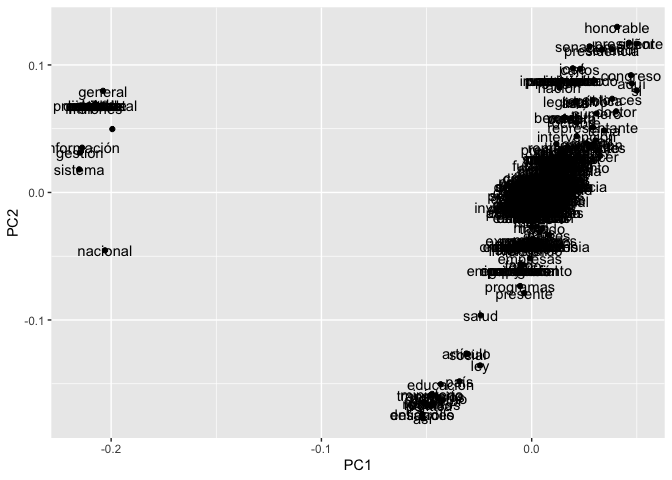
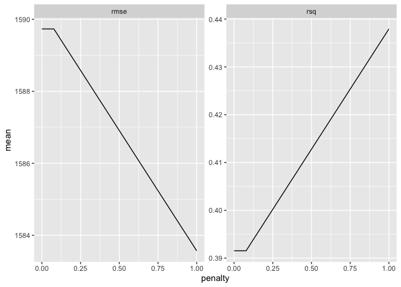

Machine Learning
================

``` r
library(tidyverse)
library(tidymodels)
library(tidytext)
library(keras)
library(irlba)
library(stopwords)
library(tm)
```

Holaaaaaaaaaaaaaaaaaaaaaaaaa mi estimada G\! Este modelo intenta
determinar a que comunicado corresponde un párrafo y con ello poder
compararlos con otros, ya que esto permite hacer un tracking sobre los
comunicados de manera eficiente

``` r
colombia <- read_rds('/Volumes/Daniel/BID/Bases_rds_BID/colombia.rds')

sparse_df <- colombia %>% 
  select(Comunicado, Texto) %>% 
  unnest_tokens("word", Texto) %>% 
  count(Comunicado, word) %>% 
  filter(!word %in% bad_words)%>% 
  mutate(word = removeNumbers(word))%>%
  filter(!is.na(word))%>%
  filter(n >= 15) %>% 
  group_by(Comunicado) %>% 
  top_n(n, n = 25) %>% 
  ungroup() %>% 
  cast_sparse(row = Comunicado, column = word, value = n)
```

Se identificaron 8 temas principales sobre los cuales se hablan en todas
las gacetas de Colombia

``` r
pca_text <- prcomp_irlba(sparse_df, n = 8, scale. = TRUE)

pca_text$center %>% 
  tidy() %>% 
  select(names) %>% 
  cbind(pca_text$rotation) %>% 
  ggplot(aes(x = PC1, y = PC2, label = names)) + 
  geom_point() + 
  geom_text()
```

<!-- -->

``` r
colombia %>% 
  select(Comunicado, Texto) %>% 
  count(Comunicado)%>%
  select(Comunicado)%>%
  head(10)->comunicados
colombia %>% 
  select(Comunicado, Texto) %>% 
  filter(Comunicado %in% comunicados$Comunicado)%>%
  unnest_tokens("word", Texto) %>% 
  count(Comunicado, word) %>% 
  filter(!word %in% bad_words)%>% 
  mutate(word = removeNumbers(word))%>%
  filter(!is.na(word))%>%
  filter(n >= 15) %>% 
  bind_tf_idf(word, Comunicado, n) %>% 
  group_by(Comunicado) %>% 
  top_n(tf_idf, n =5) %>% 
  ungroup() %>% 
  mutate(Comunicado = as.factor(Comunicado)) %>% 
  ggplot(aes(x = reorder_within(word, tf_idf, Comunicado), y = tf_idf, fill = Comunicado)) + 
  geom_col() + 
  scale_x_reordered() + 
  coord_flip() + 
  facet_wrap(~Comunicado, scales = "free") + 
  theme(legend.position = 'none')
```

<!-- -->
Acá se afirma la tesis que existen un orden para hablar de ciertos
temas, ahora a través de un proceso de inferencia bayesiana se
fortalecerá esta tesis.

``` r
library(tidylo)
colombia %>% 
  select(Comunicado, Texto) %>% 
  filter(Comunicado %in% comunicados$Comunicado)%>%
  unnest_tokens("word", Texto) %>% 
  count(Comunicado, word) %>% 
  filter(!word %in% bad_words)%>% 
  mutate(word = removeNumbers(word))%>%
  filter(!is.na(word))%>%
  filter(n >= 15) %>% 
  bind_log_odds(Comunicado, word, n) %>% 
  group_by(Comunicado) %>% 
  top_n(log_odds_weighted, n =5) %>% 
  ungroup() %>% 
  mutate(Comunicado = as.factor(Comunicado)) %>% 
  ggplot(aes(x = reorder_within(word, log_odds_weighted, Comunicado), y = log_odds_weighted, fill = Comunicado)) + 
  geom_col() + 
  scale_x_reordered() + 
  coord_flip() + 
  facet_wrap(~Comunicado, scales = "free") + 
  theme(legend.position = 'none')
```

<!-- --> Se
ajustaron los parámetros y se confirma un orden para hablar de ciertos
temas.

La anterior gráfica identifica el core por cada comunicado basado en las
comunicaciones que cada documento tiene.

### Predicción a que tipo de documentos pertenece un enunciado

``` r
set.seed(42)

tidy_data <- colombia%>%
  select(Comunicado,Texto)%>%
  mutate(Comunicado=as.numeric(Comunicado))%>%
  na.omit()

tidy_split <- initial_split(tidy_data, p = .8)
tidy_train <- training(tidy_split)
tidy_test <- testing(tidy_split)


tidy_split$in_id
```

    ##  [1]  2  3  4  5  6  8  9 11 12 13 14 15 16 17 19 20 21 22 23 26 27 28 29 30 31
    ## [26] 32 33 34 35 38 39 40 41 42 43 44 45 46 47 48 50

``` r
library(textrecipes)

text_recipe <- recipe(Comunicado~Texto, data = tidy_train) %>% 
  step_tokenize(Texto) %>% 
  step_stopwords(Texto) %>% 
  step_tokenfilter(Texto, max_tokens = 50) %>% 
  step_tf(Texto)

text_prep <- text_recipe %>% prep()

cross_validation <- vfold_cv(tidy_train, v = 10)

wf <- workflow() %>% 
  add_recipe(text_recipe)

lasso_model <- linear_reg(penalty = tune(), mixture = 1) %>% 
  set_mode("regression") %>% 
  set_engine("glmnet")

lasso_grid <- grid_regular(penalty(), levels = 10)

lasso_tune <- tune_grid(
  wf %>% add_model(lasso_model),
  resamples = cross_validation,
  grid = lasso_grid
)

lasso_tune %>% 
  collect_metrics() %>% 
  ggplot(aes(x = penalty, y = mean)) + geom_line() + facet_wrap(~.metric, scales = "free")
```

<!-- -->

``` r
set.seed(42)
lasso_best_tune <- lasso_tune %>% select_best("rmse")
  
final_lasso_model <- finalize_model(lasso_model, lasso_best_tune)  

lasso_wf <- workflow() %>% 
  add_recipe(text_recipe) %>% 
  add_model(final_lasso_model)

lasso_eval <- lasso_wf %>% last_fit(tidy_split)
lasso_eval %>% collect_metrics()
```

    ## # A tibble: 2 x 4
    ##   .metric .estimator .estimate .config             
    ##   <chr>   <chr>          <dbl> <chr>               
    ## 1 rmse    standard    399.     Preprocessor1_Model1
    ## 2 rsq     standard      0.0704 Preprocessor1_Model1

Este es un segundo modelo menos pesado y más preciso

``` r
random_forest_model <- rand_forest(mtry = 25,
                                   trees = 1000,
                                   min_n = 20) %>% 
  set_mode("regression") %>% 
  set_engine("randomForest")

random_forest_tune <- fit_resamples(
  random_forest_model,
  text_recipe,
  cross_validation
)

random_forest_tune %>% 
  collect_metrics()
```

    ## # A tibble: 2 x 6
    ##   .metric .estimator    mean     n std_err .config             
    ##   <chr>   <chr>        <dbl> <int>   <dbl> <chr>               
    ## 1 rmse    standard   302.       10 16.2    Preprocessor1_Model1
    ## 2 rsq     standard     0.423    10  0.0794 Preprocessor1_Model1

``` r
final_rf_wf <- workflow() %>% 
  add_recipe(text_recipe) %>% 
  add_model(random_forest_model) 

final_rf_eval <- final_rf_wf %>% last_fit(tidy_split)
```

``` r
final_rf_eval %>% collect_metrics() %>% mutate(model = "rf") %>% 
  rbind(lasso_eval %>% collect_metrics() %>% mutate(model = "lasso")) %>% 
  ggplot(aes(x = model, y = .estimate, fill = model)) + geom_col() + facet_wrap(~.metric, scales = "free")
```

<!-- -->

``` r
test<-tidy_test[5,]
test$Comunicado
```

    ## [1] 490

``` r
predict(final_rf_eval$.workflow[[1]], test)
```

    ## [1] "Hola Soy G! Y creo que este texto pertenece a la gaceta # 490"
